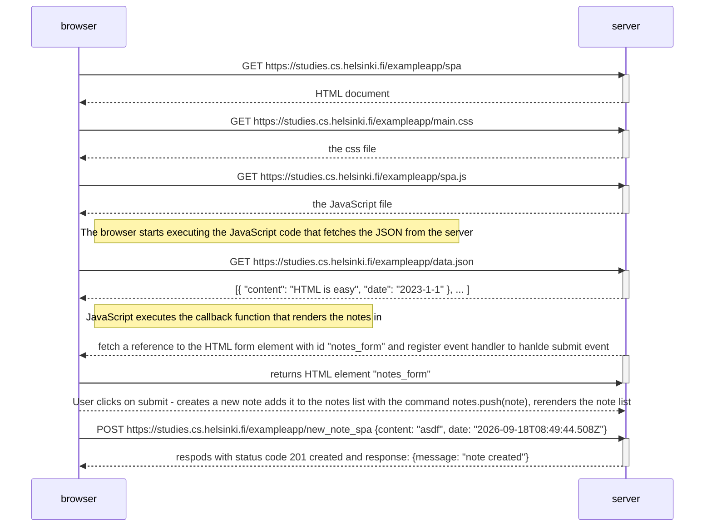

```mermaid
sequenceDiagram
    participant browser
    participant server

    browser->>server: GET https://studies.cs.helsinki.fi/exampleapp/spa
    activate server
    server-->>browser: HTML document
    deactivate server

    browser->>server: GET https://studies.cs.helsinki.fi/exampleapp/main.css
    activate server
    server-->>browser: the css file
    deactivate server

    browser->>server: GET https://studies.cs.helsinki.fi/exampleapp/spa.js
    activate server
    server-->>browser: the JavaScript file
    deactivate server

    Note right of browser: The browser starts executing the JavaScript code that fetches the JSON from the server


    browser->>server: GET https://studies.cs.helsinki.fi/exampleapp/data.json
    activate server
    server-->>browser: [{ "content": "HTML is easy", "date": "2023-1-1" }, ... ]
    deactivate server

    Note right of browser: JavaScript executes the callback function that renders the notes in

    server-->>browser: fetch a reference to the HTML form element with id "notes_form" and register event handler to hanlde submit event
    activate server
    browser->>server: returns HTML element "notes_form"
    deactivate server;
    browser-->>server: User clicks on submit - creates a new note adds it to the notes list with the command notes.push(note), rerenders the note list
    

    browser->>server: POST https://studies.cs.helsinki.fi/exampleapp/new_note_spa {content: "asdf", date: "2026-09-18T08:49:44.508Z"}
    activate server
    server-->>browser: respods with status code 201 created and response: {message: "note created"}
    deactivate server
```
